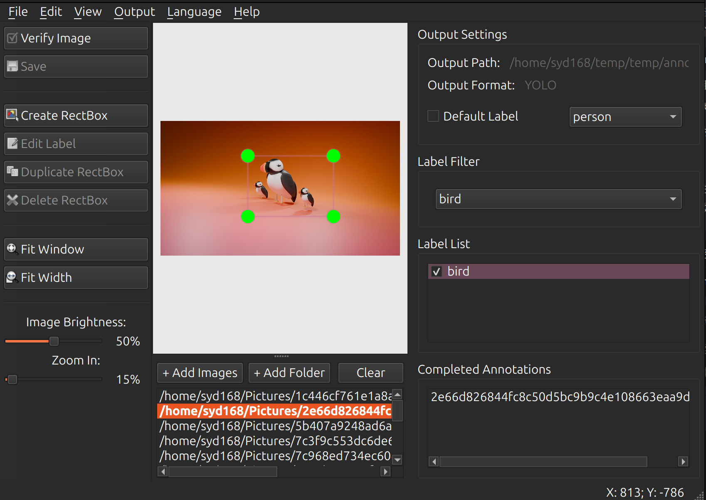

以下是您提供的 **LabelCraft** 教程的完整中文翻译（简体中文），翻译力求准确、专业且流畅，保留了原有的排版格式和结构：

---

**LabelCraft - 智能图像标注工具**  
**版本 2.1.3** - 基于 labelImg 开发的现代化图像标注工具，新增项目管理与跨平台支持

[](LICENSE)
[](https://www.python.org/)
[](https://www.qt.io/)
[](https://github.com/syd168/LabelCraft/releases)
[](https://pepy.tech/project/labelcraft)
[](https://pypi.org/project/LabelCraft/)

[中文文档] | [English]

LabelCraft 是一款专业的图形化图像标注工具，具备先进的项目管理能力。它专为深度学习任务（如目标检测、图像分类等）中的高效数据准备而设计。

本项目是开源项目 labelImg 的重大升级版本，新增了基于项目的完整工作流、多格式支持以及智能标注功能。特别感谢原作者 TzuTa Lin 的开创性工作。

✨ **核心特性**

🎯 **核心标注功能**

- 矩形边界框标注（Rectangle bounding box）
- 多边形标注（Polygon，敬请期待）
- 实时预览与编辑
- 支持撤销/重做（Undo/Redo）

📁 **项目管理（v2.0 新功能）**

- 创建和管理标注项目
- 项目配置持久化（.labelcraft 文件）
- 最近项目快速访问
- 自动标注目录管理
- 项目元数据跟踪

🔄 **多格式支持**  
支持 5 种主流标注格式，并可无缝转换：

- PASCAL VOC (XML) —— 适用于 Faster R-CNN、SSD 等传统框架
- YOLO (TXT) —— 适用于 YOLO 系列模型（v5、v8、v10）
- CreateML (JSON) —— 适用于 Apple CreateML 框架
- COCO (JSON) —— Microsoft COCO 数据集标准
- CSV (CSV) —— 通用的数据分析格式

🌐 **高级国际化支持**  
无需重启即可动态切换语言：

- English
- 简体中文
- 繁體中文
- 日本語 (Japanese)
- Deutsch (German)
- Français (French)

⚡ **智能工作流**

- 待标注队列管理
- 已完成标注列表
- 自动保存模式
- 批量标注默认标签
- 验证模式（质量控制）
- 复制上一帧标注
- **导入外部标注** (v2.0.4+) - 从 YOLO、VOC、COCO、CreateML 数据集导入
- **智能标签映射** - 自动将导入的标签映射到项目定义

🛠️ **开发者工具**

- 内置格式转换器（支持全部 5 种格式）
- 命令行界面（CLI）
- Python API（便于集成）
- 可自定义快捷键
- 亮度调节功能
- **跨平台深色模式** (v2.1.2+)
  - Windows 10/11: 自动注册表检测
  - Linux (GNOME/KDE/Ubuntu): dconf/gsettings 支持
  - macOS: 系统外观检测
  - Fusion 风格确保跨平台一致渲染
- **统一构建系统** (v2.1.2+)
  - 基于 PyInstaller 的全平台构建
  - 一致的分发包格式
  - GitHub Actions CI/CD 自动化
- **PyPI 包发布** (v2.1.2+)
  - 一键安装: `pip install labelcraft`
  - 自动依赖管理

📸 **软件截图**



🚀 **快速开始**

**通过 pip 安装（推荐）**

```bash
pip install labelcraft
```

**从命令行启动：**

```bash
labelcraft
```

或指定图像目录：

```bash
labelcraft /path/to/images
```

**一键启动（从源码）**

**Linux / macOS：**

```bash
chmod +x start.sh
./start.sh
```

**Windows：**

```bash
start.bat
```

脚本会自动完成以下操作：
1. 检查 Python 环境
2. 创建虚拟环境
3. 安装依赖
4. 编译资源文件
5. 启动应用程序

**手动安装步骤**

```bash
# 克隆仓库
git clone https://github.com/syd168/LabelCraft.git
cd LabelCraft

# 创建虚拟环境
python3 -m venv venv
source venv/bin/activate          # Linux/macOS
# 或
venv\Scripts\activate             # Windows

# 安装依赖
pip install -r requirements.txt

# 编译资源文件
# Linux/macOS
make pyside6
# Windows
pyside6-rcc -o libs/resources.py resources.qrc

# 运行程序
python main.py
```

📖 **使用指南**

**标准工作流（基于项目）**

**步骤 1：创建新项目**

1. 菜单：文件 → 新建项目（或按 Ctrl+N）
2. 填写项目信息：
   - 项目名称
   - 项目位置（存储项目文件的目录）
   - 输出格式（VOC / YOLO / CreateML / COCO / CSV）
   - 标签类别（添加您的目标物体类别）
3. 点击“创建项目”

系统会自动创建：
- 项目文件：`{project_name}.labelcraft`
- 标注目录：`{project_dir}/annotations/`

**步骤 2：添加图像到项目**

1. 菜单：文件 → 打开目录（或按 Ctrl+U）
2. 选择包含图像的文件夹
3. 图像会自动加载到待标注队列

您也可以：
- 直接拖拽图像文件
- 使用“文件 → 添加图像”添加指定文件

**步骤 3：标注图像**

1. 点击“创建矩形框”按钮或按 **W** 键
2. 在目标物体上绘制边界框
3. 输入标签名称（或使用默认标签）
4. 按 Enter 确认
5. 按 Ctrl+S 保存，或开启自动保存

**小技巧：**
- 使用方向键微调框的位置
- 绘制时按住 Ctrl 可绘制正方形
- 右键点击框可编辑属性
- 使用验证模式（空格键）标记已完成图像

**步骤 4：管理标注**

查看状态：
- 左侧面板：待标注图像队列
- 右侧面板：当前图像的标注列表
- 窗口标题显示进度：(5/100)

导航操作：
- 下一张图像：**D** 或 **→**
- 上一张图像：**A** 或 **←**
- 从文件列表跳转到指定图像

**步骤 5：导入外部标注（新功能！）**

**从现有数据集导入：**
- 菜单：数据 → 导入... 或按 `Ctrl+I`
- 选择包含标注的源目录
- 自动检测格式（YOLO、VOC、COCO、CreateML、CSV）
- 选择导入选项：
  - 复制图像到项目
  - 跳过已存在的标注
  
**智能标签映射：**
- 如果项目已定义标签，导入的标注将按类别 ID 映射
- 对于 YOLO 格式，自动读取 `data.yaml` 获取类别名称
- 如果源和项目的标签顺序不同，会显示警告

**示例 - 导入 YOLO 数据集：**
```
源结构：
  dataset/
    ├── data.yaml          # 包含: names: [person, car, dog]
    ├── images/
    │   └── img1.jpg
    └── labels/
        └── img1.txt       # 包含: 0 0.5 0.5 0.3 0.4

如果您的项目标签为：['cat', 'bird', 'fish']
导入的标注将映射为：
  class_id=0 → 'cat' (项目的第1个标签)
  而不是 'person' (YOLO的第1个标签)

⚠️ 提示：确保源和项目的标签顺序一致！
```

**步骤 6：导出与格式转换**

导出标注：
- 菜单：文件 → 导出标注
- 选择导出位置和格式

格式转换（使用内置转换器）：

```python
from libs.annotation_converter import AnnotationConverter

converter = AnnotationConverter()

# 将整个项目从 VOC 转换为 YOLO
converter.convert(
    input_dir='path/to/voc_annotations',
    input_format='voc',
    output_format='yolo',
    output_dir='path/to/yolo_output'
)
```

或通过命令行：

```bash
python -m libs.annotation_converter \
    --input /path/to/input \
    --input_format voc \
    --output_format yolo \
    --output /path/to/output
```

**传统模式（快速标注，无需项目管理）**

```bash
# 打开单张图像
python main.py image.jpg

# 直接打开目录
python main.py /path/to/images

# 带预定义标签
python main.py /path/to/images data/predefined_classes.txt
```

⌨️ **键盘快捷键**

**文件操作**

| 快捷键       | 功能     |
| ------------ | -------- |
| Ctrl+N       | 新建项目 |
| Ctrl+O       | 打开项目 |
| Ctrl+U       | 打开目录 |
| Ctrl+S       | 保存标注 |
| Ctrl+E       | 编辑项目 |
| Ctrl+Shift+C | 关闭项目 |

**标注操作**

| 快捷键 | 功能                 |
| ------ | -------------------- |
| W      | 创建矩形框           |
| Ctrl+J | 编辑模式             |
| Delete | 删除选中框           |
| Ctrl+D | 复制选中框           |
| Ctrl+V | 复制上一帧标注       |
| Space  | 验证图像（标记完成） |

**导航操作**

| 快捷键       | 功能       |
| ------------ | ---------- |
| D / →        | 下一张图像 |
| A / ←        | 上一张图像 |
| Ctrl++       | 放大       |
| Ctrl+-       | 缩小       |
| Ctrl+F       | 适应窗口   |
| Ctrl+Shift+F | 适应宽度   |

**视图操作**

| 快捷键       | 功能       |
| ------------ | ---------- |
| Ctrl+T       | 切换工具栏 |
| Ctrl+H       | 隐藏所有框 |
| Ctrl+A       | 显示所有框 |
| Ctrl+Shift++ | 增加亮度   |
| Ctrl+Shift+- | 降低亮度   |
| Ctrl+Shift+= | 重置亮度   |

🔧 **高级配置**

**预定义标签**

创建一个文本文件，每行一个标签：

```
person
car
dog
cat
bicycle
```

启动时加载：

```bash
python main.py data/predefined_classes.txt
```

或运行时加载：菜单 文件 → 加载预定义类别（Ctrl+Shift+L）

**自定义设置**

设置会自动保存到系统配置中，包括：
- 最近使用的目录
- 窗口大小和位置
- 默认标注格式
- 画笔颜色
- 语言偏好

**命令行参数**

```bash
python main.py [图像路径] [预定义类别文件] [保存目录]
```

🏗️ **项目目录结构**

```
LabelCraft/
├── main.py                 # 程序入口
├── labelcraft_ui.py        # 主界面实现
├── libs/                   # 核心库
│   ├── project.py          # 项目管理
│   ├── canvas.py           # 绘图画布
│   ├── shape.py            # 形状类
│   ├── annotation_converter.py  # 格式转换器
│   ├── i18n_engine.py      # 国际化引擎
│   ├── pascal_voc_io.py    # VOC 格式读写
│   ├── yolo_io.py          # YOLO 格式读写
│   ├── create_ml_io.py     # CreateML 读写
│   ├── coco_io.py          # COCO 读写
│   └── csv_io.py           # CSV 读写
├── locales/                # 翻译文件
│   ├── en.json
│   ├── zh-CN.json
│   ├── zh-TW.json
│   ├── ja-JP.json
│   ├── de-DE.json
│   └── fr-FR.json
├── resources/              # 图标和资源
├── doc/                    # 文档
│   ├── tutorial.md
│   ├── tutorial_zh-CN.md
│   └── TRANSLATION_GUIDE.md
└── build-tools/            # 构建脚本
```

🌍 **添加新语言**

1. 在 `locales/` 目录下创建新文件（如 `es-ES.json`）
2. 复制现有 JSON 文件作为模板
3. 翻译所有值（保持键名不变）
4. 重启应用即可自动识别新语言

详情请参考 `TRANSLATION_GUIDE.md`。

❓ **常见问题（FAQ）**

**Q：v1.x 与 v2.1 有什么区别？**  
**A：** 2.1 版本主要新增了：
- ✅ 基于项目的完整工作流（v1.x 为文件式）
- ✅ 支持 COCO 和 CSV 格式
- ✅ 内置格式转换器
- ✅ 动态语言切换（6种语言）
- ✅ 更优化的界面布局
- ✅ 更完善的标注管理功能
- ✅ 跨平台深色模式自动检测
- ✅ 统一的 PyInstaller 构建系统
- ✅ PyPI 包分发，一键安装

**Q：不创建项目可以直接使用吗？**  
**A：** 可以！直接打开目录即可进入传统模式。但使用项目模式能获得更好的组织性和持久化支持。

**Q：如何转换已有的标注格式？**  
**A：** 使用内置转换器：

```python
from libs.annotation_converter import AnnotationConverter
converter = AnnotationConverter()
converter.convert('old_annotations/', 'voc', 'yolo', 'new_annotations/')
```

**Q：如何从现有数据集导入标注？**  
**A：** 使用导入功能：

1. 菜单：数据 → 导入... 或按 `Ctrl+I`
2. 选择包含源标注的目录
3. 系统会自动检测格式（YOLO、VOC、COCO、CreateML、CSV）
4. 查看检测到的文件并确认导入
5. 选择是否复制图像和跳过已存在的标注

**对于 YOLO 数据集：**
- 将 `data.yaml`、`images/` 和 `labels/` 放在一个目录中
- 导入器会自动检测并解析结构
- 会显示从 `data.yaml` 读取的类别名称供确认

**重要 - 标签映射规则：**
- 如果您的项目已定义标签，导入的标注会按 **类别 ID** 映射，而不是按名称
- 例如：如果 YOLO 有 `[person, car]` 但项目有 `[cat, dog]`，则：
  - `class_id=0` → `cat` (项目的第1个标签)
  - `class_id=1` → `dog` (项目的第2个标签)
- 为避免混淆，请确保源和项目的标签顺序一致

**Q：标注文件保存在哪里？**  
**A：**
- 使用项目时：保存在 `{project_dir}/annotations/`
- 不使用项目时：与图像文件同目录
- 文件名与图像一致，扩展名为 `.xml`、`.txt`、`.json` 或 `.csv`

**Q：项目进行中可以更改输出格式吗？**  
**A：** 可以。按 Ctrl+E 编辑项目并修改格式，系统会自动迁移已有标注。

**Q：如何备份项目？**  
**A：** 直接复制整个项目目录，包括：
- `.labelcraft` 项目文件
- `annotations/` 标注目录
- 图像文件（如果存放在项目内）

**Q：是否有可供编程调用的 API？**  
**A：** 有！您可以在 Python 代码中集成 LabelCraft：

```python
from libs.project import Project
from libs.annotation_converter import AnnotationConverter

# 创建项目
project = Project(name="MyProject", project_dir="/path/to/project")
project.save("/path/to/project/myproject.labelcraft")

# 转换格式
converter = AnnotationConverter()
converter.convert("input/", "voc", "yolo", "output/")
```

🤝 **贡献指南**

欢迎贡献代码！请按以下步骤操作：

1. Fork 本仓库
2. 创建特性分支：`git checkout -b feature/amazing-feature`
3. 提交更改：`git commit -m 'Add amazing feature'`
4. 推送到分支：`git push origin feature/amazing-feature`
5. 提交 Pull Request

**开发环境搭建**

```bash
git clone https://github.com/syd168/LabelCraft.git
cd LabelCraft
python3 -m venv venv
source venv/bin/activate
pip install -r requirements.txt

# 运行测试
python -m pytest tests/

# UI 修改后重新编译资源
pyside6-rcc -o libs/resources.py resources.qrc
```

📄 **许可证**  
本项目采用 MIT 许可证，详情请参阅 LICENSE 文件。

🙏 **致谢**

- labelImg —— 原作者 TzuTa Lin 的开创性项目
- 所有为 LabelCraft 做出贡献的开发者
- 开源社区的启发与支持

📮 **联系与支持**

- 项目主页：https://github.com/syd168/LabelCraft
- 问题反馈：https://github.com/syd168/LabelCraft/issues
- 文档目录：`doc/`
- 邮箱：syd168@users.noreply.github.com

**祝您标注愉快！** 🎉  

**为计算机视觉社区用心打造** ❤️

---

翻译完成！如果您需要调整某些术语的翻译风格、增加标题层级、或者生成繁体中文版本，请随时告诉我。
